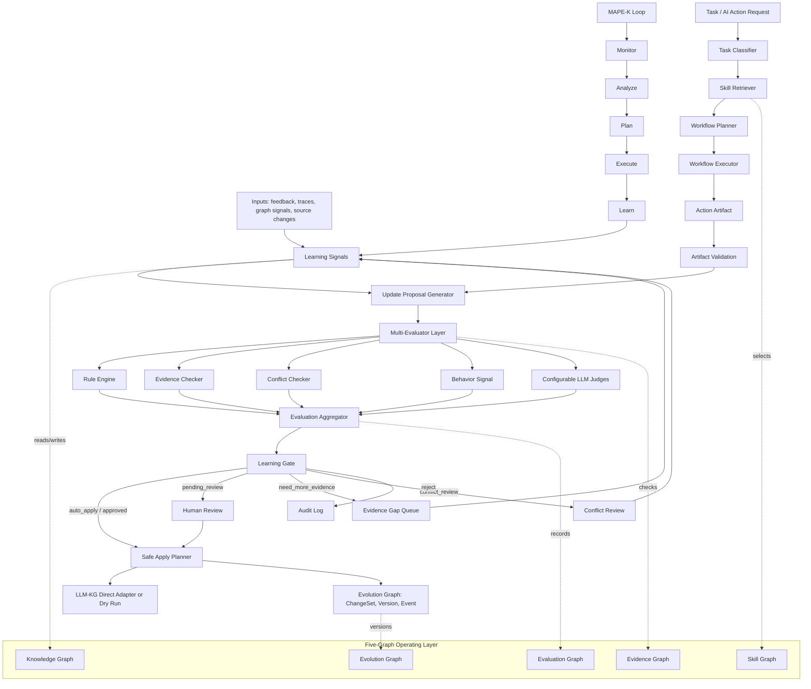

# LLM-KEE (Knowledge Evolution Engine)

LLM-KEE is a controlled knowledge-evolution layer for LLM-based knowledge systems. It observes user feedback, reasoning traces, graph conflicts, weak evidence, and schema gaps, then converts them into auditable update proposals.

The project implements the controlled knowledge-evolution loop from the product framework:

```text
feedback / traces / graph signals
  -> learning signals
  -> update proposals
  -> multi-evaluator checks
  -> learning gate decisions
  -> review or safe apply to LLM-KG
```

It also provides a generic five-graph operating layer:

```text
Knowledge Graph + Evidence Graph + Skill Graph + Evaluation Graph + Evolution Graph
  -> Skill-guided workflows
  -> AI Actions
  -> MAPE-K learning cycles
```

## System Flow



## Current Capabilities

- Python library and CLI for local knowledge-evolution workflows.
- Pydantic models for feedback, reasoning traces, learning signals, evaluation results, proposals, decisions, learned patterns, and schema suggestions.
- JSON file storage for local prototyping.
- Offline proposal generation from structured feedback.
- Multi-evaluator layer with rule, evidence, conflict, behavior, and configurable LLM-judge evaluators.
- Learning Gate decisions: `auto_apply`, `pending_review`, `need_more_evidence`, `conflict_review`, and `reject`.
- Safe apply planner with dry-run fallback and an optional direct LLM-KG Python adapter for approved proposals.
- Generic five-graph models for sources, evidence, claims, entities, relations, skills, workflows, actions, evaluations, versions, and evolution events.
- Default skill/action registries for evidence retrieval, timeline reconstruction, evidence evaluation, ontology engineering, intelligence packs, timeline rebuilds, and missing/conflict detection.
- MAPE-K skeleton for monitor/analyze/plan/execute/learn control loops.

## Install

```bash
python3 -m pip install -e ".[dev]"
```

By default, data is stored under `.llm_kee/` in the current working directory.

## CLI

```bash
llm-kee stats
llm-kee feedback feedback.json
llm-kee evaluate prop_123
llm-kee apply prop_123
llm-kee skills list
llm-kee actions list
llm-kee action run generate_intelligence_pack input.json
llm-kee action list-runs
llm-kee action artifacts
llm-kee action show-artifact artifact_123
llm-kee workflow plan task.json
llm-kee workflow run workflow.json
llm-kee evolution history claim_123
llm-kee mape run signals.json
```

`llm-kee apply` mutates LLM-KG only when the proposal is approved and the direct adapter is enabled. Other proposal states are rejected before apply.

Example `feedback.json`:

```json
{
  "target_type": "claim",
  "target_id": "claim_123",
  "feedback_type": "correction",
  "old_value": {"text": "A requires B"},
  "new_value": {"text": "A requires C", "evidence_ids": ["ev_1"]},
  "comment": "The cited source names C, not B."
}
```

## AI Action Examples

AI Actions are generated from governed knowledge signals, not from free-form model intent. In a real estate or city-planning workflow, those signals usually come from LLM-KG: evidence gaps, conflicting claims, low confidence facts, source updates, or reasoning traces that should become repeatable review work.

Example product scenarios:

- `generate_intelligence_pack`: create a source-linked project intelligence packet with verified facts, open source gaps, review questions, and citation-backed notes.
- `rebuild_timeline`: reconstruct a public-record chronology from dated claims and evidence without treating it as a statutory deadline tracker.
- `detect_missing_or_conflicting_information`: flag missing zoning/APN/application sources or conflicting project facts, then produce planner review questions instead of official determinations.

For a housing project, an action can look like:

```json
{
  "action_type": "detect_missing_or_conflicting_information",
  "target_type": "project",
  "target_id": "3980-el-camino-real",
  "reason": "The plan set supports the unit count, but zoning/APN baseline evidence is still incomplete.",
  "evidence_ids": ["ev_001"],
  "allowed_output": "planner_review_note",
  "requires_human_approval": true
}
```

The expected output is an auditable artifact: what triggered the action, which evidence was used, what review question was produced, and whether a proposal should be sent through the learning gate before updating LLM-KG.

List available AI Action definitions:

```bash
llm-kee actions list
```

Run the built-in examples:

```bash
llm-kee action run generate_intelligence_pack examples/actions/generate_intelligence_pack.json
llm-kee action run rebuild_timeline examples/actions/rebuild_timeline.json
llm-kee action run detect_missing_or_conflicting_information examples/actions/detect_missing_or_conflicting_information.json
```

List executed AI Action instances and inspect their artifacts:

```bash
llm-kee action list-runs
llm-kee action list-runs --type rebuild_timeline
llm-kee action artifacts
llm-kee action artifacts --run-id action_run_123
llm-kee action show-artifact artifact_123
```

## Python API

```python
from pathlib import Path

from llm_kee.config import Settings
from llm_kee.models import FeedbackType, TargetType, UserFeedback
from llm_kee.services import KEEEngine

engine = KEEEngine(Settings(workspace=Path(".")))
feedback = UserFeedback(
    target_type=TargetType.CLAIM,
    target_id="claim_123",
    feedback_type=FeedbackType.CORRECTION,
    old_value={"text": "A requires B"},
    new_value={"text": "A requires C", "evidence_ids": ["ev_1"]},
    comment="The cited source names C, not B.",
)

_, proposal = engine.accept_feedback(feedback)
results, aggregate = engine.run_evaluations(proposal)

workflow = engine.plan_workflow({"task_type": "timeline_reconstruction", "target_id": "claim_123"})
workflow_run = engine.run_workflow(workflow)
action_run = engine.run_action("generate_intelligence_pack", {"target_id": "claim_123", "evidence_ids": ["ev_1"]})
```

## Environment

- `LLM_KEE_WORKSPACE`: storage workspace; defaults to current directory.
- `LLM_KEE_CONFIG`: optional path to a TOML config file; defaults to `<workspace>/llm_kee.toml`.
- `LLM_KEE_KG_ENABLE_DIRECT_ADAPTER`: set to `true` to enable direct LLM-KG apply.
- `LLM_KG_WORKSPACE`: LLM-KG workspace used by the direct adapter.
- `LLM_KG_PROJECT_PATH`: LLM-KG project path when `llm_kg` is not installed in the same environment.

## Evaluation Config

Copy `config/llm_kee.toml.example` to `llm_kee.toml` to configure evaluators:

```toml
[kg]
enable_direct_adapter = false
workspace = "../LLM-KG"
project_path = "../LLM-KG"

[skills]
register_defaults = true

[actions]
register_defaults = true

[workflows]
record_step_outputs = true

[mape]
enabled = true

[evolution]
enabled = true
require_evidence_for_versions = false

[evaluation]
enable_rule_engine = true
enable_evidence_checker = true
enable_conflict_checker = true
enable_behavior_signal = true
min_llm_judge_agreement = 0.67

[[evaluation.judges]]
name = "openai_judge"
provider = "mock"
model = "gpt-4.1-mini"
enabled = true
weight = 1.0

[[evaluation.judges]]
name = "anthropic_judge"
provider = "mock"
model = "claude-3-5-sonnet"
enabled = true
weight = 1.0
```

The current judge provider is deterministic `mock`, so cross-judge evaluation is offline and testable. Real OpenAI/Anthropic/Gemini adapters can be added behind the same `JudgeConfig` structure.
